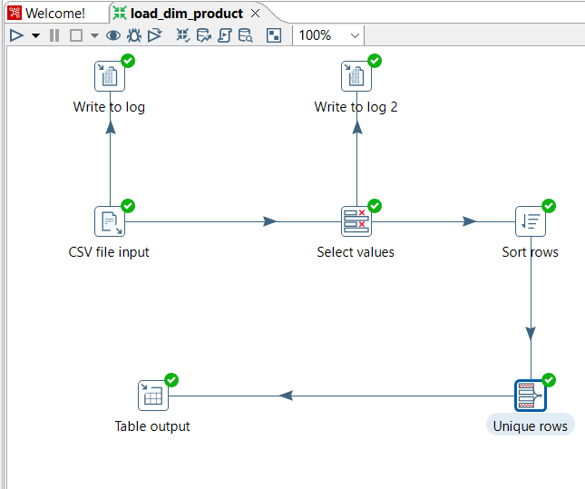
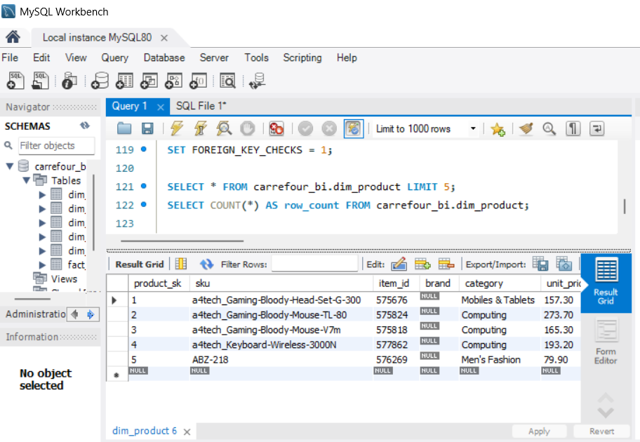
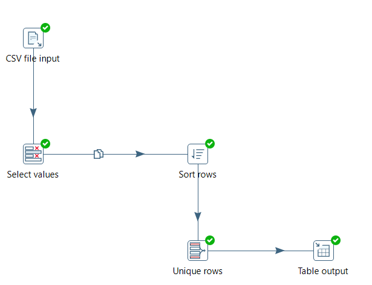
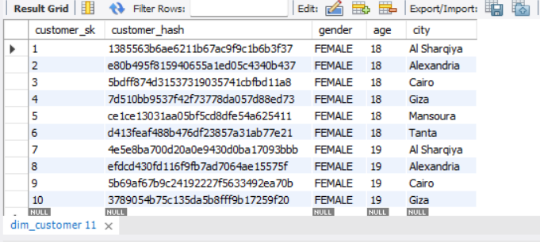

# PROJET_ETL_CARREFOUR
- This project builds a complete Business Intelligence solution for analyzing Carrefour's e-commerce performance. It extracts raw transaction data from CSV files, transforms and cleans it through Pentaho ETL pipelines, loads structured data into a MySQL Star Schema Data Warehouse, and enables interactive analytics through Python dashboards.

# Architecture & Tools
- Source: Raw CSV datasets containing transaction history.

- ETL Tool: Pentaho Data Integration (PDI) used for data cleaning, handling missing values, and business logic implementation.

- Data Warehouse: MySQL used to host a structured Star Schema (Fact and Dimension tables).

- Analysis & Visualization: Python (Pandas, Matplotlib, Seaborn) for deep dive analysis and KPI tracking.

# Key Features
- Automated Cleaning: Removal of duplicates and normalization of dates/currencies via Pentaho.

- Star Schema Design: Optimized database structure for fast analytical queries.

- Business Intelligence:

     Sales trend analysis (Daily/Monthly).

     Top-performing product categories.

     Customer behavior patterns.

## ETL Pipelines

### 1) load_dim_product.ktr
*Product Dimension Loading Pipeline*

*Figure 1: Pentaho ETL Transformation Flow for Product Dimension*

| Metric | Value |
|--------|-------|
| **Source** | Carrefour CSV (64,006 rows) |
| **Target** | `dim_product` (MySQL) |
| **Key Fields** | `sku`, `item_id`, `category`, `unit_price` |
| **Transformations** | Field filtering, type conversion (Integer→String), price→unit_price mapping |
| **Data Quality** | Duplicate SKU removal via Sort Rows + Unique Rows |
| **Performance** | Batch inserts (1000 rows/commit) |
| **Status** | PRODUCTION READY |

**ETL Flow**:

*Figure 2: Sample Data from dim_product Table - Validated Product Records*

### 2️) load_dim_customer.ktr
*Customer Dimension Loading Pipeline with MD5 Hash Generation*

*Figure 3: Pentaho ETL Transformation Flow for Customer Dimension*

| Metric | Value |
|--------|-------|
| **Source** | Carrefour CSV (64,006 rows) |
| **Target** | `dim_customer` (MySQL) |
| **Key Fields** | `gender`, `age`, `city`, `customer_hash` |
| **Transformations** | Field filtering, deduplication on customer profile |
| **Unique ID Strategy** | MD5 hash: `MD5(CONCAT(gender, '_', age, '_', city))` |
| **Data Quality** | Duplicate customer removal via Sort Rows + Unique Rows |
| **Status** | PRODUCTION READY |

**ETL Flow**:

*Figure 4: Sample Data from dim_customer Table - Customer Records with MD5 Hashes*
